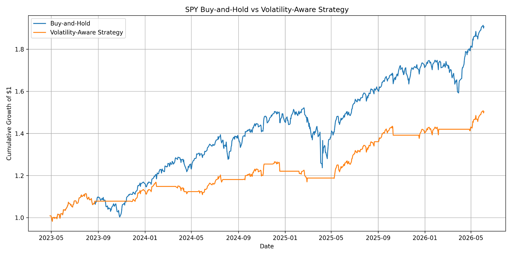
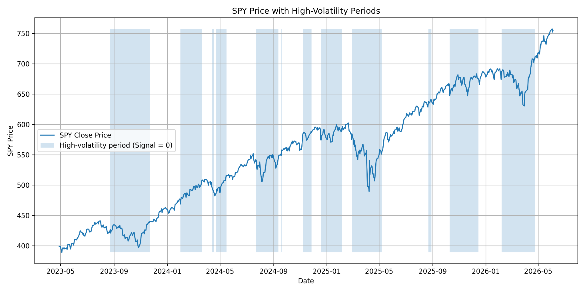

# Volatility-Aware SPY Strategy Backtest

A Python backtest that evaluates whether reducing SPY exposure during periods
of elevated volatility can improve downside-risk control relative to a simple
buy-and-hold strategy.

## Project motivation

Investors often face a trade-off between maximizing returns and limiting losses
during volatile markets. This project tests a transparent, rules-based approach:
remain invested when short-term volatility is at or below its recent average,
and move to cash when it rises above that benchmark.

The goal is not to predict future prices. It is to compare the historical return
and risk characteristics of two strategies using reproducible quantitative
analysis.

## Strategy methodology

1. Download daily SPY prices from January 2023 through June 2026.
2. Calculate daily returns and 20-trading-day rolling volatility.
3. Compare current 20-day volatility with its trailing 60-day average.
4. Hold SPY when short-term volatility is at or below the average; otherwise,
   hold cash.
5. Apply the previous day's signal to avoid look-ahead bias.
6. Compare the strategy with buy-and-hold using annualized return, annualized
   volatility, Sharpe ratio, and maximum drawdown.

## Results

| Metric | Buy-and-Hold | Volatility-Aware Strategy |
|---|---:|---:|
| Annualized return | 23.27% | 14.11% |
| Annualized volatility | 15.02% | 8.19% |
| Sharpe ratio | 1.55 | 1.72 |
| Maximum drawdown | -18.76% | -7.55% |

Buy-and-hold generated the higher return during the selected period. The
volatility-aware strategy produced lower volatility, a smaller maximum drawdown,
and a higher Sharpe ratio, demonstrating the cost-benefit trade-off between raw
returns and risk control.





## Tools and techniques

- Python
- pandas and NumPy
- yfinance
- Matplotlib
- Rolling-window volatility analysis
- Rules-based signal generation
- Backtesting and risk-adjusted performance evaluation
- Look-ahead-bias prevention
- Optional OpenAI API interpretation

## Repository structure

```text
.
├── spy_backtest.py
├── requirements.txt
├── data/
├── figures/
├── results/
└── report/
```

## Run the project

```bash
python -m venv .venv
source .venv/bin/activate
pip install -r requirements.txt
python spy_backtest.py
```

The project runs without an OpenAI API key. To regenerate the optional
AI-assisted interpretation, set `OPENAI_API_KEY` securely in your environment
and run:

```bash
GENERATE_AI_INTERPRETATION=1 python spy_backtest.py
```

Never store API keys in the repository.

## Limitations

- Results cover one ETF and one historical period.
- Transaction costs, slippage, taxes, and interest on cash are excluded.
- The Sharpe ratio uses a zero risk-free rate.
- Strategy settings were not validated out of sample.
- Historical backtest results do not guarantee future performance.

## Disclaimer

This project is for educational and analytical purposes only and does not
constitute financial advice.
